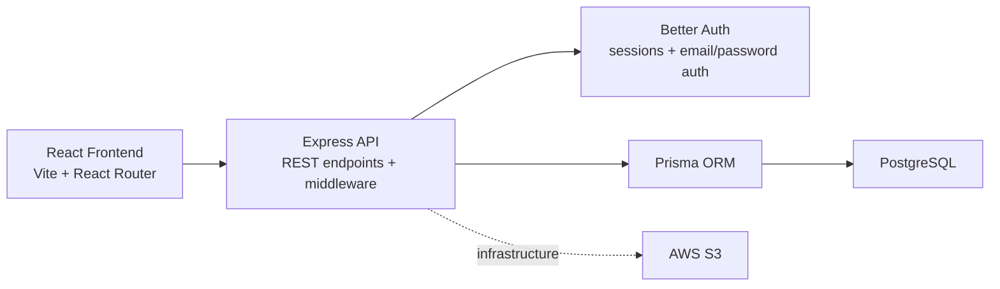

# Angelman Syndrome Video Management Portal

A secure web-based platform for managing and reviewing caregiver-recorded seizure videos for Angelman Syndrome clinical research. Built in collaboration with Dr. Wen-Hann Tan and the Angelman Syndrome Clinical Research Group at Boston Children's Hospital.

## Overview

The portal supports four user roles: caregivers, clinical reviewers, site coordinators, and system administrators. Each user comes with clearly defined access boundaries and toggleable permissions.

Core features include secure video upload, video streaming, timestamped annotations, video clipping, and a full audit trail.

This repository is still in active development, so some features described in project documents are planned rather than fully implemented.

## Tech Stack

| Layer | Technology |
| --- | --- |
| Frontend | React 19, TypeScript, Vite, React Router 7 |
| Styling/UI | Tailwind CSS 4, Base UI, shadcn-style component patterns |
| Backend | Express 5, TypeScript, Better Auth, Zod |
| Data Layer | Prisma 7, PostgreSQL 16 |
| Testing | Vitest, Testing Library, Supertest |
| Infra | Docker Compose, AWS RDS, AWS S3, AWS Secrets Manager |

## Repository Structure

```text
video-review-system/
├── frontend/          # React SPA
├── backend/           # Express + TypeScript API
└── docker-compose.yml # Local service orchestration
```

## Requirements

Make sure the following are installed before getting started:

- [Node.js](https://nodejs.org/) 20+
- `npm` 10+
- [Docker](https://www.docker.com/) + Docker Compose if you want to run PostgreSQL in a container
- PostgreSQL 16+ if you want to run the database locally without Docker

## Quick Start

### 1. Install dependencies

```bash
cd frontend
npm install

cd ../backend
npm install
```

### 2. Create `.env` in the repo root

### 3. Start PostgreSQL

If you want to use Docker for the database:

```bash
docker compose up -d postgres
```

### 4. Start the backend

```bash
cd backend
npx prisma generate
npx prisma migrate dev
npm run dev
```

The backend runs on `http://localhost:8080` when `PORT=8080` is set in `.env`.

### 5. Start the frontend

In a separate terminal:

```bash
cd frontend
npm run dev
```

The frontend runs on `https://localhost:5173` with the current Vite config.

## Architecture Overview

Current application flow:



- The frontend is a React single-page app served separately from the backend.
- The backend is an Express API that handles HTTP routing, validation, auth integration, and domain logic.
- Better Auth manages session and credential flows, while application-level authorization is built on top of it.
- Prisma is the data access layer between the backend and PostgreSQL.
- AWS storage is the infrastructure for video storage and retrieval.

## User Roles

| Role | Access |
| --- | --- |
| Caregiver | Upload and view only their own videos |
| Clinical Reviewer | Review videos, add notes, and participate in clinician workflows |
| Site Coordinator | Manage users and workflows within their site scope |
| System Administrator | Global administrative access across the system |

## Key Libraries

Notable libraries currently used:

- `better-auth` for authentication and session handling
- `prisma` and `@prisma/client` for the database layer
- `zod` for request validation and schema parsing
- `@base-ui/react` for UI primitives
- `mediabunny` for frontend video-processing utilities
- `vitest`, `@testing-library/react`, and `supertest` for testing

## Testing

This repo includes both frontend and backend tests, with the backend test setup being more fully documented in [backend/README.md](/Users/jan/dev/cs4535/angelman-video-portal/video-review-system/backend/README.md).

Common commands:

- `frontend`: `npm test`
- `backend`: `npm test`
- `backend`: `npm run test:unit`
- `backend`: `npm run test:http`
- `backend`: `npm run test:coverage`

At a high level:

- frontend tests cover UI behavior and feature-level components
- backend tests cover request validation, routing behavior, and service-layer logic

## Screenshots / Demo

To be added.

## Additional Service Docs

- [`frontend/README.md`](./frontend/README.md)
- [`backend/README.md`](./backend/README.md)
