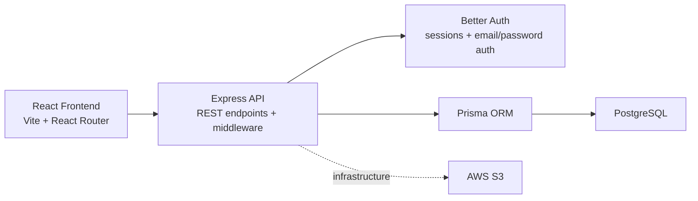

# Angelman Syndrome Video Management Portal

A secure web-based platform for managing and reviewing caregiver-recorded seizure videos for Angelman Syndrome clinical research. Built in collaboration with Dr. Wen-Hann Tan and the Angelman Syndrome Clinical Research Group at Boston Children's Hospital.

## Overview

The portal supports four user roles: caregivers, clinical reviewers, site coordinators, and system administrators. Each user comes with clearly defined access boundaries and toggleable permissions.

Core features include secure video upload, video streaming, timestamped annotations, video clipping, and a full audit trail.

## Tech Stack

| Layer | Technology |
| --- | --- |
| Frontend | React 19, TypeScript, Vite, React Router 7 |
| Styling/UI | Tailwind CSS 4, Base UI, shadcn-style component patterns |
| Backend | Express 5, TypeScript, Better Auth, Zod |
| Data Layer | Prisma 7, PostgreSQL 16 |
| Testing | Vitest, Testing Library, Supertest |
| Infra | Docker Compose, AWS RDS, AWS S3, AWS Secrets Manager |

## Repository Structure

```text
video-review-system/
├── frontend/          # React SPA
├── backend/           # Express + TypeScript API
└── docker-compose.yml # Local service orchestration
```

## Requirements

Make sure the following are installed before getting started:

- [Node.js](https://nodejs.org/) 20+
- `npm` 10+
- [Docker](https://www.docker.com/) + Docker Compose if you want to run PostgreSQL in a container
- PostgreSQL 16+ if you want to run the database locally without Docker
- AWS CLI (https://aws.amazon.com/cli/)

## Quick Start

### 1. Install dependencies

The project uses **AWS Secrets Manager** to store environment secrets (database URLs, API keys, etc.) rather than committing them to the repository. To access these secrets, you first need to authenticate with AWS using SSO (Single Sign-On).

Run the following command and follow the prompts:

```bash
aws configure sso
```

When prompted, enter the following values:

| Prompt | Value |
|--------|-------|
| SSO session name | Any name you want (e.g. `dev`) |
| SSO start URL | The URL from your AWS invitation email |
| SSO region | `us-east-1` |
| SSO registration scopes | Press Enter to accept the default |
| _(browser opens)_ | Sign in with your AWS credentials |
| Default client region | `us-east-1` |
| Default output format | Press Enter to accept the default |
| Profile name | **Must be set to `default`** |

### 2. Create `.env` in the project root

Once authenticated, run the script below. It fetches the project secrets from AWS Secrets Manager and writes them to a local `.env` file:

```bash
./scripts/pull-env.sh
```

> **Note:** You will need to re-run this script whenever your AWS SSO session expires (typically after 8 hours) or when secrets are rotated.

### 3. Start all services

```bash
docker compose up -d postgres
```

### 4. Start the backend

```bash
cd backend
npx prisma generate
npx prisma migrate dev
npm run dev
```

The backend runs on `http://localhost:8080` when `PORT=8080` is set in `.env`.

### 5. Start the frontend

In a separate terminal:

```bash
cd frontend
npm run dev
```

The frontend runs on `https://localhost:5173` with the current Vite config.

## Local development (no AWS)

If you don't have AWS access (or just want a self-contained setup), you can run
the whole stack against a local Docker Postgres with no Secrets Manager, RDS, or
SSM. This path is driven by a `LOCAL=true` flag in the root `.env`.

### 1. Create `.env` in the project root

Copy `.env.example` and uncomment the **"Fully-local dev (no AWS)"** block at the
bottom, then generate a `BETTER_AUTH_SECRET`:

```bash
cp .env.example .env
openssl rand -base64 32   # paste into BETTER_AUTH_SECRET
```

Key points for this path:

- `LOCAL=true` — makes `backend/src/lib/prisma.ts` use `LOCAL_DATABASE_URL` and
  disable SSL (local Postgres doesn't speak SSL; RDS requires it). It also
  points the S3 and SES clients at LocalStack (see below).
- `PORT=3000` — the Vite dev server proxies `/api` to `localhost:3000`, so the
  backend **must** run on 3000 (not the `8080` used by the AWS path).
- Uncomment the **LocalStack** vars too (`S3_ENDPOINT`, `S3_BUCKET_NAME`,
  `SES_*`, dummy `AWS_*` creds) so video storage and email work locally.

### 2. Start Postgres + LocalStack

```bash
docker compose up -d postgres localstack
```

[LocalStack](https://www.localstack.cloud/) provides local S3 (video storage)
and SES (invite / password-reset email) so no real AWS is needed.
`scripts/localstack-init.sh` runs on startup to create the S3 bucket, set its
CORS policy (needed for the browser's direct multipart uploads), and verify the
SES sender. Sent emails are also logged to the backend console as
`[DEV-ONLY] Activation link: ...`, so you can click them without a mail client.

### 3. Migrate and seed the database

```bash
cd backend
npx prisma migrate deploy
npx prisma db seed
```

The seed creates a small realistic dataset — 2 sites, 3 studies, and
caregiver-uploaded videos with varied review status — plus one user per role
(all with password `password123`):

| Email | Role | Sees |
|-------|------|------|
| `admin@local.dev` | SYSADMIN | everything |
| `coordinator@local.dev` | SITE_COORDINATOR | the Boston site |
| `reviewer@local.dev` | CLINICAL_REVIEWER | the Seizure Characterization study only |
| `caregiver1@local.dev` | CAREGIVER | their own Boston uploads |
| `caregiver2@local.dev` | CAREGIVER | their own Seattle uploads |

The seed is destructive-but-idempotent (it wipes the managed tables and
recreates them), so you can re-run `npx prisma db seed` any time. When
`LOCAL=true` and LocalStack is running, it also uploads a small public sample
video to each video's `s3Key` so playback works — this is best-effort and never
fails the seed (override the clip with `SEED_SAMPLE_VIDEO_URL`).

### 4. Start the backend and frontend

```bash
cd backend && npm run dev       # http://localhost:3000
cd frontend && npm run dev      # https://localhost:5173
```

Log in at `https://localhost:5173/login` with any of the seeded users above.

> **Note:** if you skip LocalStack, the server still boots (the S3/SES clients
> construct lazily) — only video upload/playback and outgoing email will fail.

## Architecture Overview

Current application flow:


```mermaid
flowchart LR
    A["React Frontend<br/>Vite + React Router"] --> B["Express API<br/>REST endpoints + middleware"]
    B --> C["Better Auth<br/>sessions + email/password auth"]
    B --> D["Prisma ORM"]
    D --> E["PostgreSQL"]
    B -. "infrastructure" .-> F["AWS S3"]
```

- The frontend is a React single-page app served separately from the backend.
- The backend is an Express API that handles HTTP routing, validation, auth integration, and domain logic.
- Better Auth manages session and credential flows, while application-level authorization is built on top of it.
- Prisma is the data access layer between the backend and PostgreSQL.
- AWS storage is the infrastructure for video storage and retrieval.

## User Roles

| Role | Access |
| --- | --- |
| Caregiver | Upload and view only their own videos |
| Clinical Reviewer | Review videos, add notes, and participate in clinician workflows |
| Site Coordinator | Manage users and workflows within their site scope |
| System Administrator | Global administrative access across the system |

## Key Libraries

Notable libraries currently used:

- `react-router` for client-side routing, route loaders, and frontend navigation structure
- `better-auth` for authentication and session handling
- `prisma` and `@prisma/client` for the database layer
- `zod` for request validation and schema parsing
- `@base-ui/react` for UI primitives
- `mediabunny` for frontend video-processing utilities
- `vitest`, `@testing-library/react`, and `supertest` for testing

## Testing

This repo includes both frontend and backend tests, with the backend test setup being more fully documented in [backend/README.md](./backend/README.md).

Common commands:

- `frontend`: `npm test`
- `backend`: `npm test`
- `backend`: `npm run test:unit`
- `backend`: `npm run test:http`
- `backend`: `npm run test:coverage`

At a high level:

- frontend tests cover UI behavior and feature-level components
- backend tests cover request validation, routing behavior, and service-layer logic

## Screenshots / Demo

To be added.

## Additional Service Docs

- [`frontend/README.md`](./frontend/README.md)
- [`backend/README.md`](./backend/README.md)

## Deploying to Coolify (develop)

An **additive, development-testing** deployment target, separate from the AWS
production path (which is unchanged). It runs the full stack — including working
video upload/playback — on a self-hosted Coolify server, using a containerized
MinIO object store in place of S3. See
`docs/superpowers/specs/2026-07-11-coolify-develop-deployment-design.md` for the
design.

### What gets deployed

One Coolify **Docker Compose** resource (`docker-compose.coolify.yml`) with four
services: `frontend` (nginx, public), `backend` (internal), `postgres`
(persistent volume), and `minio` (object store, public S3 API).

### DNS

Point two hostnames at the Coolify server:
- `dev.<domain>` — the app (frontend).
- `s3.dev.<domain>` — the MinIO S3 API (the browser uploads/streams here directly).

### One-time Coolify setup

1. **Create the resource:** New Resource → Docker Compose → this repo, branch
   `develop`, compose file `docker-compose.coolify.yml`.
2. **Environment variables:** paste the filled-in values from
   `.env.coolify.example` (generate every secret with `openssl rand -base64 32`).
   Set `ALLOWED_ORIGIN` / `FRONTEND_URL` / `BETTER_AUTH_URL` to `https://dev.<domain>`
   and `S3_ENDPOINT` to `https://s3.dev.<domain>`. Leave `SES_FROM_EMAIL` unset.
3. **Domains:**
   - `frontend` → `https://dev.<domain>` (container port 80).
   - `minio` → `https://s3.dev.<domain>` (container port **9000** only — do NOT
     expose the 9001 console publicly).
4. **Basic Auth:** enable Coolify/Traefik HTTP Basic Auth on the `frontend`
   domain only. Do NOT put Basic Auth on `s3.dev.<domain>` — presigned
   upload/stream URLs must stay reachable (the bucket is already private).
5. **Auto-deploy on merge to `develop`:** connect the **Coolify GitHub App** and
   enable automatic deployment for the `develop` branch.
   - ⚠️ The repo is in the `KhourySpecialProjects` org, so installing the GitHub
     App needs an **org-owner approval**. Until then, use Coolify's manual
     **Deploy** button — the deployment works; only the automation waits on
     approval.

### First deploy

Click **Deploy**. On first boot the backend runs `prisma migrate deploy`, detects
an empty database, seeds it, and (best-effort, `LOCAL=true`) uploads sample media
to MinIO. Later deploys skip seeding, so data and uploaded videos persist.

### Smoke test

1. Visit `https://dev.<domain>` (pass Basic Auth), log in as `admin@local.dev`
   with your `SEED_PASSWORD`.
2. Browse the reviews list (seeded data appears).
3. Upload a video and play it back (exercises the MinIO presigned round trip).
4. Trigger an invite from the admin UI and confirm the activation link appears in
   the `backend` service logs (log-only email).

### Notes

- **Log-only email:** no mail is sent; invite/reset links are logged by the
  backend. This is intentional for dev.
- **Seed password:** `SEED_PASSWORD` sets the seeded users' password so the public
  admin login is not a known credential.
- This target never touches AWS. Production still deploys via `scripts/deploy-*.sh`.
