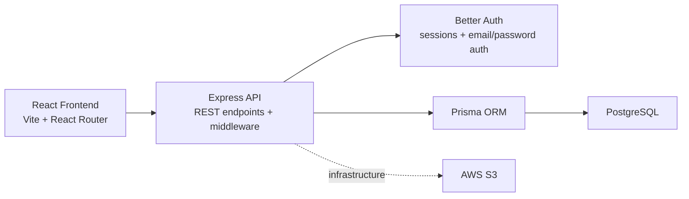

# Angelman Syndrome Video Management Portal

A secure web-based platform for managing and reviewing caregiver-recorded seizure videos for Angelman Syndrome clinical research. Built in collaboration with Dr. Wen-Hann Tan and the Angelman Syndrome Clinical Research Group at Boston Children's Hospital.

## Overview

The portal supports four user roles: caregivers, clinical reviewers, site coordinators, and system administrators. Each user comes with clearly defined access boundaries and toggleable permissions.

Core features include secure video upload, video streaming, timestamped annotations, video clipping, and a full audit trail.

## Tech Stack

| Layer | Technology |
| --- | --- |
| Frontend | React 19, TypeScript, Vite, React Router 7 |
| Styling/UI | Tailwind CSS 4, Base UI, shadcn-style component patterns |
| Backend | Express 5, TypeScript, Better Auth, Zod |
| Data Layer | Prisma 7, PostgreSQL 16 |
| Testing | Vitest, Testing Library, Supertest |
| Infra | Docker Compose, AWS RDS, AWS S3, AWS Secrets Manager |

## Repository Structure

```text
video-review-system/
├── frontend/          # React SPA
├── backend/           # Express + TypeScript API
└── docker-compose.yml # Local service orchestration
```

## Requirements

Make sure the following are installed before getting started:

- [Node.js](https://nodejs.org/) 20+
- `npm` 10+
- [Docker](https://www.docker.com/) + Docker Compose if you want to run PostgreSQL in a container
- PostgreSQL 16+ if you want to run the database locally without Docker
- AWS CLI (https://aws.amazon.com/cli/)

## Quick Start

### 1. Install dependencies

The project uses **AWS Secrets Manager** to store environment secrets (database URLs, API keys, etc.) rather than committing them to the repository. To access these secrets, you first need to authenticate with AWS using SSO (Single Sign-On).

Run the following command and follow the prompts:

```bash
aws configure sso
```

When prompted, enter the following values:

| Prompt | Value |
|--------|-------|
| SSO session name | Any name you want (e.g. `dev`) |
| SSO start URL | The URL from your AWS invitation email |
| SSO region | `us-east-1` |
| SSO registration scopes | Press Enter to accept the default |
| _(browser opens)_ | Sign in with your AWS credentials |
| Default client region | `us-east-1` |
| Default output format | Press Enter to accept the default |
| Profile name | **Must be set to `default`** |

### 2. Create `.env` in the project root

Once authenticated, run the script below. It fetches the project secrets from AWS Secrets Manager and writes them to a local `.env` file:

```bash
./scripts/pull-env.sh
```

> **Note:** You will need to re-run this script whenever your AWS SSO session expires (typically after 8 hours) or when secrets are rotated.

### 3. Start all services

```bash
docker compose up -d postgres
```

### 4. Start the backend

```bash
cd backend
npx prisma generate
npx prisma migrate dev
npm run dev
```

The backend runs on `http://localhost:8080` when `PORT=8080` is set in `.env`.

### 5. Start the frontend

In a separate terminal:

```bash
cd frontend
npm run dev
```

The frontend runs on `https://localhost:5173` with the current Vite config.

## Local development (no AWS)

If you don't have AWS access (or just want a self-contained setup), you can run
the whole stack against a local Docker Postgres with no Secrets Manager, RDS, or
SSM. This path is driven by a `LOCAL=true` flag in the root `.env`.

### 1. Create `.env` in the project root

Copy `.env.example` and uncomment the **"Fully-local dev (no AWS)"** block at the
bottom, then generate a `BETTER_AUTH_SECRET`:

```bash
cp .env.example .env
openssl rand -base64 32   # paste into BETTER_AUTH_SECRET
```

Key points for this path:

- `LOCAL=true` — makes `backend/src/lib/prisma.ts` use `LOCAL_DATABASE_URL` and
  disable SSL (local Postgres doesn't speak SSL; RDS requires it). It also
  points the S3 and SES clients at LocalStack (see below).
- `PORT=3000` — the Vite dev server proxies `/api` to `localhost:3000`, so the
  backend **must** run on 3000 (not the `8080` used by the AWS path).
- Uncomment the **LocalStack** vars too (`S3_ENDPOINT`, `S3_BUCKET_NAME`,
  `SES_*`, dummy `AWS_*` creds) so video storage and email work locally.

### 2. Start Postgres + LocalStack

```bash
docker compose up -d postgres localstack
```

[LocalStack](https://www.localstack.cloud/) provides local S3 (video storage)
and SES (invite / password-reset email) so no real AWS is needed.
`scripts/localstack-init.sh` runs on startup to create the S3 bucket, set its
CORS policy (needed for the browser's direct multipart uploads), and verify the
SES sender. Sent emails are also logged to the backend console as
`[DEV-ONLY] Activation link: ...`, so you can click them without a mail client.

### 3. Migrate and seed the database

```bash
cd backend
npx prisma migrate deploy
npx prisma db seed
```

The seed creates a small realistic dataset — 2 sites, 3 studies, and
caregiver-uploaded videos with varied review status — plus one user per role
(all with password `password123`):

| Email | Role | Sees |
|-------|------|------|
| `admin@local.dev` | SYSADMIN | everything |
| `coordinator@local.dev` | SITE_COORDINATOR | the Boston site |
| `reviewer@local.dev` | CLINICAL_REVIEWER | the Seizure Characterization study only |
| `caregiver1@local.dev` | CAREGIVER | their own Boston uploads |
| `caregiver2@local.dev` | CAREGIVER | their own Seattle uploads |

The seed is destructive-but-idempotent (it wipes the managed tables and
recreates them), so you can re-run `npx prisma db seed` any time. When
`LOCAL=true` and LocalStack is running, it also uploads a small public sample
video to each video's `s3Key` so playback works — this is best-effort and never
fails the seed (override the clip with `SEED_SAMPLE_VIDEO_URL`).

### 4. Start the backend and frontend

```bash
cd backend && npm run dev       # http://localhost:3000
cd frontend && npm run dev      # https://localhost:5173
```

Log in at `https://localhost:5173/login` with any of the seeded users above.

> **Note:** if you skip LocalStack, the server still boots (the S3/SES clients
> construct lazily) — only video upload/playback and outgoing email will fail.

## Architecture Overview

Current application flow:


```mermaid
flowchart LR
    A["React Frontend<br/>Vite + React Router"] --> B["Express API<br/>REST endpoints + middleware"]
    B --> C["Better Auth<br/>sessions + email/password auth"]
    B --> D["Prisma ORM"]
    D --> E["PostgreSQL"]
    B -. "infrastructure" .-> F["AWS S3"]
```

- The frontend is a React single-page app served separately from the backend.
- The backend is an Express API that handles HTTP routing, validation, auth integration, and domain logic.
- Better Auth manages session and credential flows, while application-level authorization is built on top of it.
- Prisma is the data access layer between the backend and PostgreSQL.
- AWS storage is the infrastructure for video storage and retrieval.

## User Roles

| Role | Access |
| --- | --- |
| Caregiver | Upload and view only their own videos |
| Clinical Reviewer | Review videos, add notes, and participate in clinician workflows |
| Site Coordinator | Manage users and workflows within their site scope |
| System Administrator | Global administrative access across the system |

## Key Libraries

Notable libraries currently used:

- `react-router` for client-side routing, route loaders, and frontend navigation structure
- `better-auth` for authentication and session handling
- `prisma` and `@prisma/client` for the database layer
- `zod` for request validation and schema parsing
- `@base-ui/react` for UI primitives
- `mediabunny` for frontend video-processing utilities
- `vitest`, `@testing-library/react`, and `supertest` for testing

## Testing

This repo includes both frontend and backend tests, with the backend test setup being more fully documented in [backend/README.md](./backend/README.md).

Common commands:

- `frontend`: `npm test`
- `backend`: `npm test`
- `backend`: `npm run test:unit`
- `backend`: `npm run test:http`
- `backend`: `npm run test:coverage`

At a high level:

- frontend tests cover UI behavior and feature-level components
- backend tests cover request validation, routing behavior, and service-layer logic

## Screenshots / Demo

To be added.

## Additional Service Docs

- [`frontend/README.md`](./frontend/README.md)
- [`backend/README.md`](./backend/README.md)

## Deploying to Coolify (develop)

An **additive, development-testing** deployment target, separate from the AWS
production path (which is unchanged). It runs the full stack — including working
video upload/playback — on a self-hosted Coolify server, using a containerized
MinIO object store in place of S3. See
`docs/superpowers/specs/2026-07-11-coolify-develop-deployment-design.md` for the
design.

### What gets deployed

One Coolify **Docker Compose** resource (`docker-compose.coolify.yml`) with four
services: `frontend` (nginx, public), `backend` (internal), `postgres`
(persistent volume), and `minio` (object store, public S3 API).

### DNS

Point two hostnames at the Coolify server:
- `dev.<domain>` — the app (frontend).
- `s3.dev.<domain>` — the MinIO S3 API (the browser uploads/streams here directly).

### One-time Coolify setup

1. **Create the resource:** New Resource → Docker Compose → this repo, branch
   `develop`, compose file `docker-compose.coolify.yml`.
2. **Environment variables:** fill in the values from `.env.coolify.example`.
   - **Generate these secrets** with `openssl rand -base64 32`:
     `BETTER_AUTH_SECRET`, `ADMIN_SECRET`, `INTERNAL_SECRET_HEADER`,
     `SEED_PASSWORD`, `MINIO_ROOT_USER`, `MINIO_ROOT_PASSWORD`. Generate
     `POSTGRES_PASSWORD` with `openssl rand -hex 32` instead — the compose file
     interpolates it into the DB connection URL, so it must be URL-safe (base64
     can emit `/ + =`).
   - **`POSTGRES_PASSWORD` is the only DB variable you set.** The user and
     database names are fixed literals (`angelman`) in
     `docker-compose.coolify.yml`, and all three DSNs
     (`DATABASE_URL` / `LOCAL_DATABASE_URL` / `DIRECT_DATABASE_URL`) are built
     from them by a YAML anchor. Do not set `POSTGRES_USER`, `POSTGRES_DB`, or
     any DSN in Coolify — compose ignores them.
   - Set `ALLOWED_ORIGIN` / `FRONTEND_URL` / `BETTER_AUTH_URL` to
     `https://dev.<domain>` and `S3_ENDPOINT` to `https://s3.dev.<domain>`.
     Leave `SES_FROM_EMAIL` unset.
3. **Domains:**
   - `frontend` → `https://dev.<domain>` (container port 80).
   - `minio` → `https://s3.dev.<domain>` (container port **9000** only — do NOT
     expose the 9001 console publicly).
4. **Access control:** there is **no extra network gate** — access is the app's
   own Better Auth login, and `SEED_PASSWORD` ensures the seeded admin is not a
   publicly-known credential. Note this leaves the unauthenticated surface (login
   page, password-reset/invite flows, `/api/health`, static assets) reachable by
   anyone who has the URL. That's an accepted trade-off for a dev target. If you
   later want to keep this non-production build off the open internet, add an
   edge gate at Traefik — a source-IP allowlist, or an HTTP Basic Auth middleware
   on the `frontend` service **only** (never `s3.dev.<domain>`, or presigned
   upload/stream URLs break).
5. **Auto-deploy on push to `develop`:** connect the **Coolify GitHub App** to
   the repository and enable automatic deployment for the `develop` branch.
   Coolify registers the repo webhook, so pushes to `develop` redeploy
   automatically. (If you plan to add per-PR preview deployments later, leave the
   "Preview Deployments" permission checked when creating the app — it only grants
   the capability and avoids a second permission approval down the line.)
   - If the repository lives in a GitHub **organization**, installing the app must
     be approved by an org owner — immediate if you are an owner, otherwise it
     goes to the owners as a request. Coolify's manual **Deploy** button works in
     the meantime, so the deployment itself is never blocked — only the automation.

### First deploy

Click **Deploy**. On first boot the backend runs `prisma migrate deploy`, detects
an empty database, seeds it, and (best-effort, `LOCAL=true`) uploads sample media
to MinIO. Later deploys skip seeding, so data and uploaded videos persist.

### Smoke test

1. Visit `https://dev.<domain>` and log in as `admin@local.dev` with your
   `SEED_PASSWORD`.
2. Browse the reviews list (seeded data appears).
3. Upload a video and play it back (exercises the MinIO presigned round trip).
4. Trigger an invite from the admin UI and confirm the activation link appears in
   the `backend` service logs (log-only email).

### Notes

- **Log-only email:** no mail is sent; invite/reset links are logged by the
  backend. This is intentional for dev.
- **Seed password:** `SEED_PASSWORD` sets the seeded users' password so the public
  admin login is not a known credential.
- This target never touches AWS. Production still deploys via `scripts/deploy-*.sh`.

## Deploying to Coolify (next)

`next` is a **second long-lived Coolify deployment** at
`next.asclepion.cs4535.cloud`, separate from `dev`. It exists so changes can be
seen running **without redeploying `dev`** while clients are user-testing there.
It reuses `docker-compose.coolify.yml` unchanged — only the environment differs.
See `docs/superpowers/specs/2026-07-15-next-coolify-deployment-design.md`.

### `next` is a forward-only branch: `next` → `develop` → `main`

`next` is a normal long-lived branch, the **frontline** of a three-tier promotion
pipeline. It sits *ahead* of `develop` and only ever moves **forward** — via
merges, never a force-push or reset. This is the same discipline `develop` and
`main` already follow, and it is what keeps every environment's database safe:
because no branch rewinds, Prisma migrations only ever roll forward.

- **`next`** (`next.asclepion.cs4535.cloud`, blue banner) — frontline integration
  and live preview. New work lands here first.
- **`develop`** (`dev.asclepion.cs4535.cloud`, amber banner) — client-testing /
  release candidate.
- **`main`** — production gate.

**Working on `next`:** branch a feature off `next`, open a PR **against `next`**,
and merge it (merge commit, delete the branch). The push to `next` auto-deploys to
`next.asclepion.cs4535.cloud` — no Coolify UI interaction and no force-push.

**Promotion is the release step — on your cadence, not per feature:**

1. When a batch on `next` is proven and the client test window allows, open a PR
   **`next` → `develop`** and merge it. `dev.asclepion` redeploys and clients see
   the change.
2. `develop` → `main` stays a separate gate.

**Hotfix escape hatch.** If something urgent must reach the client-facing `dev`
without waiting for the whole `next` batch, branch off `develop`, PR into
`develop`, then **merge `develop` back into `next`** to keep `next` ahead. This
mirrors merging `main` back into `develop` after a hotfix.

**Never force-push or rewind `next`.** Pointing it at an older commit leaves its
database ahead of the schema its code expects (Prisma migrates forward, never
back), which strands the deployment. If that ever happens, recover by wiping its
`postgres_data` volume in Coolify and letting it re-seed — `next` holds no data
worth keeping.

### DNS

Point two hostnames at the Coolify server:
- `next.asclepion.cs4535.cloud` — the app (frontend).
- `s3.next.asclepion.cs4535.cloud` — the MinIO S3 API (the browser
  uploads/streams here directly).

### One-time Coolify setup

1. **Create the `next` branch:** `git push origin develop:next`. This is the one
   and only time `next` is set from another branch — from here it only moves
   forward via merges.
2. **Create the resource — build it fresh; do NOT clone the `dev` resource.**
   New Resource → **Private Repository (GitHub App)** → this repo. Use the GitHub
   App source, not "Public Repository" — that is what wires the auto-deploy
   webhook. Then set **Build Pack: Docker Compose** (Nixpacks is the default and
   must be changed explicitly).

   > Coolify's docs do not state whether cloning a resource copies environment
   > variable **values**. It treats cloning as a config duplicate, so it very
   > likely carries dev's secrets across verbatim — which defeats the whole point
   > of separate environments. A few minutes of pasting beats sharing a
   > `BETTER_AUTH_SECRET` between a client-facing deployment and a scratch one.

3. **Branch:** `next`. Coolify pre-fills the repo's *default* branch, so this must
   be changed. **Docker Compose Location:** `docker-compose.coolify.yml` — the
   default assumes `docker-compose.yml`, which is the local dev stack and the
   wrong file entirely. **Base Directory:** `/`.
4. **Environment variables:** use `.env.coolify.next.example`. Generate **fresh**
   secrets; do not copy dev's.
5. **Mark `VITE_APP_ENV` as a BUILD variable** (value `next-preview`). Coolify has
   independent per-row **Build Variable** and **Runtime Variable** toggles, both
   on by default — leave both on. Vite bakes the value in at build time, so a
   runtime-only variable silently does nothing and `next` renders dev's amber
   banner.
6. **Domains — the port goes in the domain string,** not in a separate field:
   - `frontend` → `https://next.asclepion.cs4535.cloud` (listens on 80, so no
     port suffix needed).
   - `minio` → `https://s3.next.asclepion.cs4535.cloud:9000`

   The `:9000` only tells Coolify where to route *inside* the container; the proxy
   still serves the domain on 443. Do **not** give the 9001 console a domain.
   Entering the domain with `https://` is what triggers automatic Let's Encrypt
   issuance, so DNS must already resolve or the ACME challenge fails.
7. **Auto-deploy:** Advanced tab → **Auto Deploy**. The GitHub App normally enables
   this already. It tracks the resource's own **Branch** field, so `next` pushes
   deploy `next` and nothing else.

### Smoke test

1. Visit `https://next.asclepion.cs4535.cloud` — confirm the **blue** "NEXT
   (staging)" banner. Amber means `VITE_APP_ENV` was set as a runtime variable
   instead of a build variable.
2. Log in as `admin@local.dev` with the **`next`** `SEED_PASSWORD`.
3. Upload a video and play it back (exercises the presigned round trip against
   `s3.next.asclepion.cs4535.cloud`).
4. Merge a commit to `next` (or push one) and confirm Coolify redeploys with no UI
   interaction.

### Notes

- **`next` and `dev` share nothing at runtime** — separate volumes, buckets,
  seeded data, and secrets. `next` can be wrecked and rebuilt freely.
- **Volumes cannot collide, even though both resources build from the same
  compose file with the same volume names.** Coolify appends each resource's UUID
  to the volume name specifically to prevent overlap between resources, so
  `next`'s `postgres_data` is a different Docker volume from `dev`'s. This is why
  running two environments off one compose file is safe.
- **`next` is where infrastructure changes get proven first**, before they reach
  the client-facing `dev`.

### Telemetry + feedback (GlitchTip)

Errors (frontend + backend) and in-app tester feedback flow to a **self-hosted
GlitchTip** instance — a separate Coolify resource, shared by `next` and `dev`.

**One-time operator setup (in Coolify, outside this repo):**
1. Create a GlitchTip **Docker Compose** resource (GlitchTip web + worker +
   its own Postgres + Redis) and point a domain at it (e.g.
   `glitchtip.cs4535.cloud`). GlitchTip is independent of the Asclepion app.
2. In GlitchTip, create two projects: `asclepion-next` and `asclepion-dev`.
3. Copy each project's **DSN** into the matching Asclepion deployment:
   - Frontend (mark these **BUILD** variables in Coolify): `VITE_GLITCHTIP_DSN`,
     `VITE_TELEMETRY_PRIVACY`.
   - Backend (runtime): `SENTRY_DSN`, `SENTRY_ENVIRONMENT`, `TELEMETRY_PRIVACY`.

**Privacy switch:** `*_TELEMETRY_PRIVACY` / `TELEMETRY_PRIVACY` = `full` on
`next`/`dev` (max data during testing; no real PII there), `scrubbed` in
production (pseudonymous identity, parametrized URLs, no screenshots). Unset
defaults to `scrubbed`. An empty DSN disables telemetry entirely.

**Triage → Linear:** work through issues in GlitchTip; feedback is tagged
`feedback` with a `feedback.type` of `bug`/`confusing`/`idea`. When an issue
deserves a ticket, create the Linear issue and cross-link (paste the GlitchTip
URL onto the Linear issue and the Linear URL back onto the GlitchTip issue).
